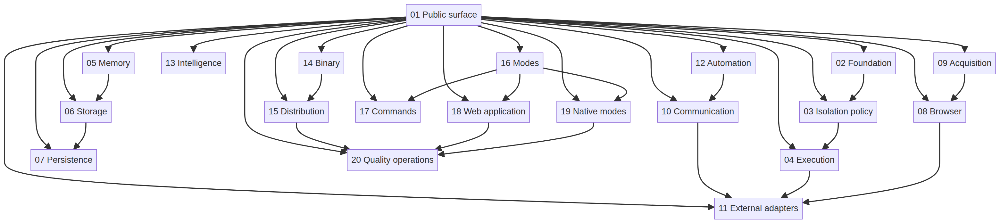
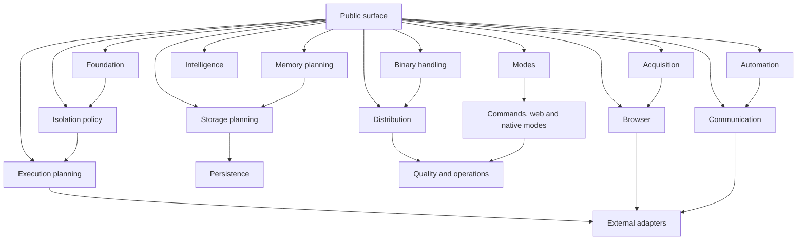

# Saddle 1.8.19 architecture organization

## Objective

This reorganization preserves every existing capability while making ownership and dependency direction easier to inspect. The root entry point remains a thin universal router. Public contracts remain additive and stable. Existing package subpaths remain compatible. Generated `dist/` output remains untracked.

> A domain groups correlated behavior, contracts and tests. It is not a claim that unrelated code is removed or that an infrastructure adapter is activated.

## Twenty correlated domains

| ID | Domain | Current ownership | Allowed direction |
| --- | --- | --- | --- |
| 01 | Public surface | `index.ts`, `library/` | Re-exports domain façades only. |
| 02 | Foundation | `core/` | Defines errors, identifiers, hashing, events and serializable nouns. |
| 03 | Isolation policy | `isolation/`, API policy helpers | Evaluates approval, denial, handoff and receipt boundaries. |
| 04 | Execution planning | `runtime/`, `runners/` | Plans and observes work through caller-owned adapters. |
| 05 | Memory planning | `memory/` | Defines internal working-set, targets, transforms and bounded plans. |
| 06 | Storage planning | `storage/` | Defines adapter-owned content, cache, chunk and synchronization contracts. |
| 07 | Persistence | `persistence/` | Defines optional schema, migration and provider-neutral persistence adapters. |
| 08 | Browser | `browser/`, `extension/` | Defines browser, virtual-browser, extension and session contracts without user-profile access. |
| 09 | Acquisition | `scrape/`, `captcha/` | Defines request, crawl, extract, proxy and challenge contracts. |
| 10 | Communication | `api/` | Defines authenticated envelopes, transports, rate policy and event serialization. |
| 11 | External adapters | `adapters/` | Defines replaceable forge, socket, app and MCP adapters. |
| 12 | Automation | `automation/`, `surfaces/` | Defines automation manifests, permissions, triggers and surface requirements. |
| 13 | Intelligence | `ai/` | Defines token, chunk, retrieval, provenance and metric contracts. |
| 14 | Binary handling | `binary/` | Defines archive, build and transformation plans without execution. |
| 15 | Distribution | `packager/`, `release/` | Defines package, artifact, delivery, readiness and evidence contracts; filesystem-backed asset verification remains an explicit subpath. |
| 16 | Modes | `modes/`, `server/` | Defines target modes, surface profiles and host-neutral service/deployment adapters; the Node server remains an explicit subpath only. |
| 17 | Commands | `cli/` | Defines command parsing, presentation and command-level integration. |
| 18 | Web application | `web/` | Defines static routes, UI components, visual assets and build boundaries. |
| 19 | Native modes | `desktop/`, `android/`, `ios/`, `extension/` | Defines platform packaging metadata and calls library contracts. |
| 20 | Quality and operations | `tests/`, `.github/`, `docs/` | Defines deterministic evidence, build checks, release operations and architecture records. |

## Dependency flow

The root may import only domain façades. Each façade may import its owned modules and lower-level contracts. Runtime, browser, storage, binary and remote-provider behavior remain adapter-owned: no domain may add implicit host, filesystem, browser-profile, network or provider effects.

## Compatibility rules

Existing module paths referenced by package exports remain valid. A module may be moved only after a compatibility shim or an equivalent export is in place, all relative imports are updated, and the package dry-run includes the expected output. Native mode metadata, workflow paths, CLI command paths and static web routing are release boundaries and therefore move only with corresponding validation.

## Implementation order

The first reorganization block groups the public root exports behind domain façades. The second groups adjacent library modules where no package subpath or native workflow depends on their exact location. The final block aligns tests and documentation with the same 20 domains. Each block must pass the engine build, active tests, legacy tests, formatting, package inspection, web checks and native-flat validation before the next block begins.
